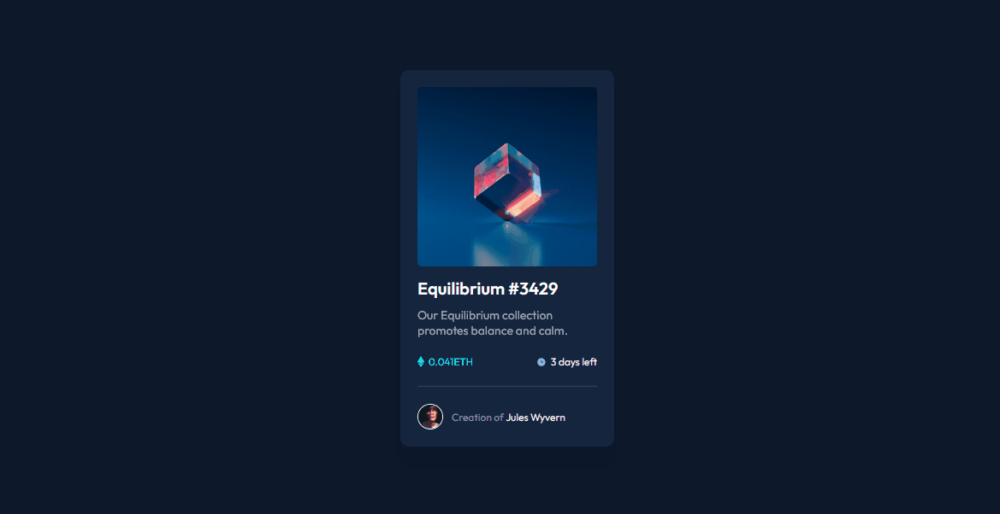

# Frontend Mentor - NFT preview card component solution

This is a solution to the [NFT preview card component challenge on Frontend Mentor](https://www.frontendmentor.io/challenges/nft-preview-card-component-SbdUL_w0U). Frontend Mentor challenges help you improve your coding skills by building realistic projects.

## Table of contents

- [Overview](#overview)
  - [The challenge](#the-challenge)
  - [Screenshot](#screenshot)
  - [Links](#links)
- [My process](#my-process)
  - [Built with](#built-with)
  - [What I learned](#what-i-learned)
  - [Continued development](#continued-development)
  - [Useful resources](#useful-resources)
- [Author](#author)

## Overview

### The challenge

Users should be able to:

- View the optimal layout depending on their device's screen size
- See hover states for interactive elements

### Screenshot



### Links

- Solution URL: [Click Here](https://github.com/rialbeg/NFT-preview-card-component)
- Live Site URL: [Click Here](https://rialbeg.github.io/NFT-preview-card-component/)

## My process

### Built with

- Semantic HTML5 markup
- CSS
- Flexbox

### What I learned

This project was a great way to practice positioning with flexbox. Also, I was able to learn a few tricks to do the active states as shown in the code below.The simplest solution usually is the most elegant one.

To see how you can add code snippets, see below:

```html
<h1>Some HTML code I'm proud of</h1>
```

```css
.overlay {
  opacity: 0;
}
.overlay:hover {
  opacity: 1;
}
```

### Continued development

I want to keep focusing on the basic concepts. Although they are easy to grasp I believe it is never enough to practice them.

### Useful resources

- [W3schools](https://www.w3schools.com/) - Always a life saver to check the syntax and the properties of css.
- [Opacity Hover](https://www.w3schools.com/css/css_image_transparency.asp) - This helped me with the active state in the card image.

## Author

- Website - [GabrielMascarenhas](https://rialbeg.github.io/portfolio/)
- Frontend Mentor - [@rialbeg](https://www.frontendmentor.io/profile/rialbeg)
